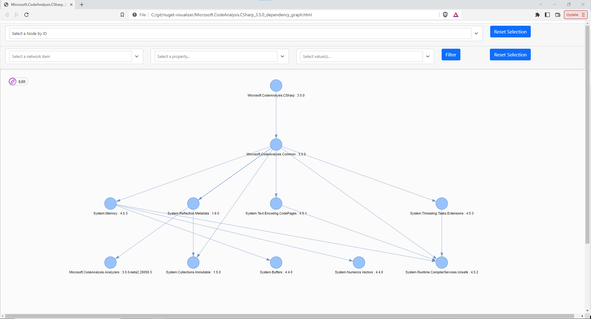
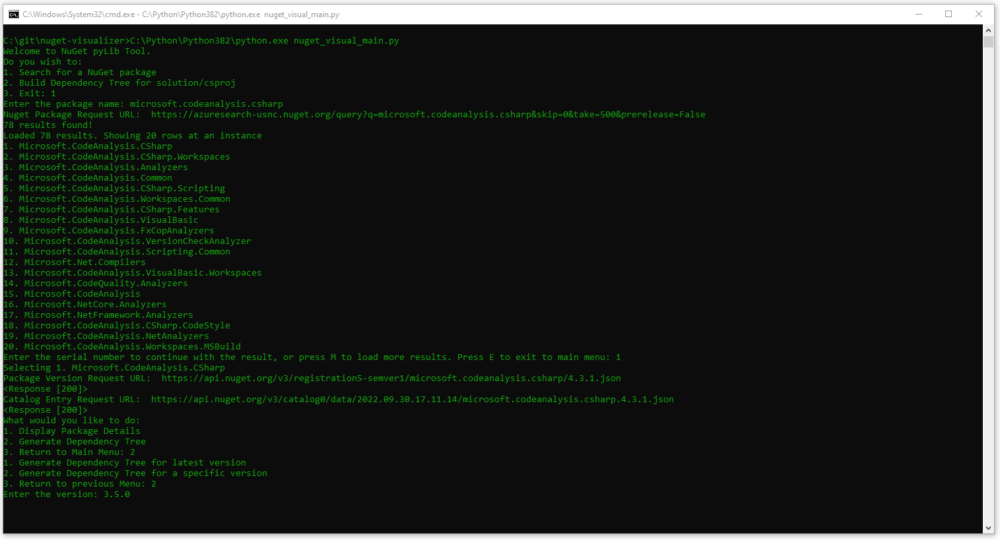
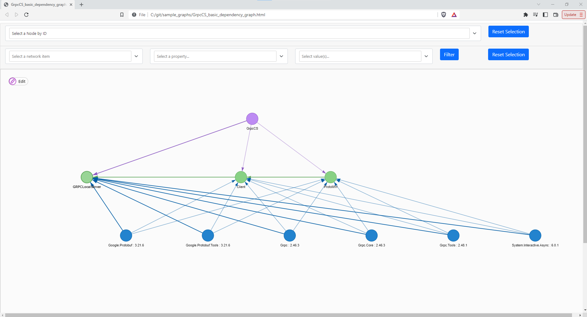

# NuGet Visualizer

An interactive script that helps you to visualize NuGet package dependencies as well as dependencies of your Solution and csproj.

A sample dependency graph for sample solution:



Requirements:
Python 3.8+ 

Python requirements:
```
- requests
- os
- xmltodict
- json
- pyvis.network
```

To install requirements, run:
``
pip install -r requirements.txt
``

This script helps the users to generate:
1. NuGet Package Dependencies
2. Solution/csproj dependencies


### 1. NuGet Package

Script Workflow:
* Search for a certain NuGet package
* Select from the result
* Generate dependency for latest or specific version

The script calls the NuGet API's recursively and generate the dependencies of the mentioned version. 

Searching for *microsoft.codeanalysis.csharp*:



Generated Graph:




### 2. Solution/csproj Dependencies

Script Workflow:
* Can choose between solution file or csproj
* Enter the path
* If csproj:
    * Generates the Package and Project references
* If Solution:
    * Scans all csproj associated and generates all the packages and project references
* Option to generate a basic graph, or a full feature graph (scans the dependencies of all the NuGet packages associated)

You can check the sample_graph folder as an example. Download the folder and run the html file. 

### Rate Limit

NuGet has published its Rate Limit, i.e. The number of requests a client can make to NuGet server. 

If there is any error, it may be because the request limit has been breached.

To know more about the Rate Limit:

The current request rate limit is defined here:
https://learn.microsoft.com/en-us/nuget/api/rate-limits

